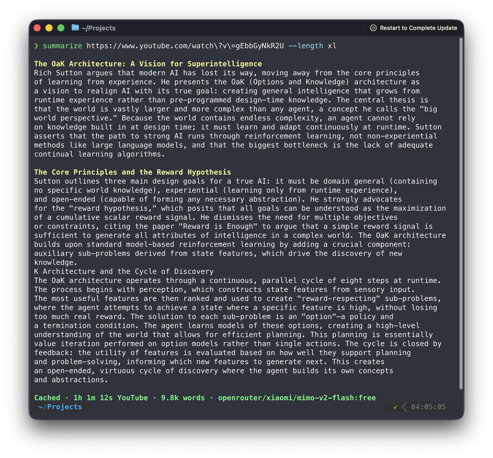

# Summarize 📝 — Bun-native CLI

Summarize is a Bun-native CLI app for extracting content and generating summaries from URLs, files, and media.

## Highlights

- **YouTube slides**: screenshots + OCR + transcript-aware summaries.
- Media-aware summaries: auto‑detect video/audio vs page content.
- Streaming Markdown + metrics + cache‑aware status.
- CLI supports URLs, files, podcasts, YouTube, audio/video, PDFs.

## Feature overview

- URLs, files, and media: web pages, PDFs, images, audio/video, YouTube, podcasts, RSS.
- Slide extraction for video sources (YouTube/direct media) with OCR + timestamped cards.
- Transcript-first media flow: published transcripts when available, then Groq/ONNX/whisper.cpp/AssemblyAI/Gemini/OpenAI/FAL transcription fallback when not.
- Streaming output with Markdown rendering, metrics, and cache-aware status.
- Local, paid, and free models: OpenAI‑compatible local endpoints, paid providers, plus an OpenRouter free preset.
- Output modes: Markdown/text, JSON diagnostics, extract-only, metrics, timing, and cost estimates.
- Smart default: if content is shorter than the requested length, we return it as-is (use `--force-summary` to override).

## Efficiency Notes

- CLI-only repo: the browser extension and its tests were removed to shrink the surface area and dependency graph; a minimal GitHub Actions gate validates the CLI and release artifacts.
- Large-page extraction: repeated HTML parsing and hidden-content cleanup were collapsed into shared passes, and obvious non-media pages now skip unnecessary transcript probing.
- YouTube/media: direct media URLs short-circuit earlier, duplicate player/duration requests were removed, and the default YouTube path now prefers a small embed/bootstrap flow before falling back to the watch page.
- Extraction hot paths are guarded locally with `bun run perf:guard`, and the normal gate runs it via `bun run check`.
- Current state: article extraction is mostly fetch-bound; the biggest remaining latency variance is external network/transcript provider behavior, not local parsing overhead.

## CLI



### Install

Built with Bun. The installer downloads a compiled binary, so it does not require Node or npm.

- One-command install (compiled Bun binary for macOS Apple Silicon and Linux x64):

```bash
curl -fsSL https://raw.githubusercontent.com/fightingentropy/summarize/main/scripts/install.sh | bash
```

By default that installs `summarize` into `~/.local/bin`.

Useful overrides:

- `SUMMARIZE_INSTALL_DIR=/usr/local/bin`
- `SUMMARIZE_VERSION=v0.14.1` (kept in sync with `package.json` by `bun run release:version:sync`)
- `SUMMARIZE_GITHUB_REPO=fightingentropy/summarize`

Current release installer targets: macOS Apple Silicon and Linux x64.

The installer checks the SHA-256 record and rejects archives containing anything other than one regular root file named `summarize` before extraction. Tagged releases are rebuilt and receive GitHub artifact provenance in CI. To independently verify a manually downloaded archive:

```bash
gh attestation verify summarize-<target>-v<version>.tar.gz --repo fightingentropy/summarize
```

### Optional local dependencies

Install these if you want media-heavy features:

- `ffmpeg`: required for `--slides` and many local media/transcription flows
- `yt-dlp`: required for YouTube slide extraction and some remote media flows
- `swiftc` via Xcode Command Line Tools: optional fallback for `--slides-ocr` on macOS source/dev builds when a prebuilt Vision OCR helper is unavailable
- Optional cloud transcription providers:
  - `GROQ_API_KEY`
  - `ASSEMBLYAI_API_KEY`
  - `GEMINI_API_KEY` / `GOOGLE_GENERATIVE_AI_API_KEY` / `GOOGLE_API_KEY`
  - `OPENAI_API_KEY`
  - `FAL_KEY`

macOS:

```bash
# install ffmpeg and yt-dlp with your package manager of choice
xcode-select --install # optional fallback for source/dev --slides-ocr builds on macOS
```

If `--slides` is enabled and these tools are missing, Summarize warns and continues without slides.

### Quickstart

```bash
summarize "https://example.com"
```

### Inputs

URLs or local paths:

```bash
summarize "/path/to/file.pdf" --model google/gemini-3-flash
summarize "https://example.com/report.pdf" --model google/gemini-3-flash
summarize "/path/to/audio.mp3"
summarize "/path/to/video.mp4"
```

Stdin (pipe content using `-`):

```bash
echo "content" | summarize -
pbpaste | summarize -
# binary stdin also works (PDF/image/audio/video bytes)
cat /path/to/file.pdf | summarize -
```

**Notes:**

- Stdin has a 50MB size limit
- The `-` argument tells summarize to read from standard input
- Text stdin is treated as UTF-8 text (whitespace-only input is rejected as empty)
- Binary stdin is preserved as raw bytes and file type is auto-detected when possible
- Useful for piping clipboard content or command output

YouTube (supports `youtube.com` and `youtu.be`):

```bash
summarize "https://youtu.be/dQw4w9WgXcQ" --youtube auto
```

Podcast RSS (transcribes latest enclosure):

```bash
summarize "https://feeds.npr.org/500005/podcast.xml"
```

Apple Podcasts episode page:

```bash
summarize "https://podcasts.apple.com/us/podcast/2424-jelly-roll/id360084272?i=1000740717432"
```

Spotify episode page (best-effort; may fail for exclusives):

```bash
summarize "https://open.spotify.com/episode/5auotqWAXhhKyb9ymCuBJY"
```

### Output length

`--length` controls how much output we ask for (guideline), not a hard cap.

```bash
summarize "https://example.com" --length long
summarize "https://example.com" --length 20k
```

- Presets: `short|medium|long|xl|xxl`
- Character targets: `1500`, `20k`, `20000`
- Optional hard cap: `--max-output-tokens <count>` (e.g. `2000`, `2k`)
  - Provider/model APIs still enforce their own maximum output limits.
  - If omitted, no max token parameter is sent (provider default).
  - Prefer `--length` unless you need a hard cap.
- Short content: when extracted content is shorter than the requested length, the CLI returns the content as-is.
  - Override with `--force-summary` to always run the LLM.
- Minimums: `--length` numeric values must be >= 50 chars; `--max-output-tokens` must be >= 16.
- Preset targets (source of truth: `src/prompts/summary-lengths.ts`):
  - short: target ~900 chars (range 600-1,200)
  - medium: target ~1,800 chars (range 1,200-2,500)
  - long: target ~4,200 chars (range 2,500-6,000)
  - xl: target ~9,000 chars (range 6,000-14,000)
  - xxl: target ~17,000 chars (range 14,000-22,000)

### What file types work?

Best effort and provider-dependent. These usually work well:

- `text/*` and common structured text (`.txt`, `.md`, `.json`, `.yaml`, `.xml`, ...)
  - Text-like files are inlined into the prompt for better provider compatibility.
- PDFs: `application/pdf` (provider support varies; Google is the most reliable here)
- Images: `image/jpeg`, `image/png`, `image/webp`, `image/gif`
- Audio/Video: `audio/*`, `video/*` (local audio/video files MP3/WAV/M4A/OGG/FLAC/MP4/MOV/WEBM automatically transcribed, when supported by the model)

Notes:

- If a provider rejects a media type, the CLI fails fast with a friendly message.
- xAI models do not support attaching generic files (like PDFs) via the AI SDK; use Google/OpenAI/Anthropic for those.

### Model ids

Use gateway-style ids: `<provider>/<model>`.

Examples:

- `openai/gpt-5-mini`
- `anthropic/claude-sonnet-4-5`
- `xai/grok-4-fast-non-reasoning`
- `google/gemini-3-flash`
- `zai/glm-4.7`
- `openrouter/openai/gpt-5-mini` (force OpenRouter)

Note: some models/providers do not support streaming or certain file media types. When that happens, the CLI prints a friendly error (or auto-disables streaming for that model when supported by the provider).

### Limits

- Text inputs over 10 MB are rejected before tokenization.
- Text prompts are preflighted against the model input limit (LiteLLM catalog), using a GPT tokenizer.

### Common flags

```bash
summarize <input> [flags]
```

Use `summarize --help` or `summarize help` for the full help text.

- `--model <provider/model>`: which model to use (defaults to `auto`)
- `--model auto`: automatic model selection + fallback (default)
- `--model <name>`: use a config-defined model (see Configuration)
- `--timeout <duration>`: `30s`, `2m`, `5000ms` (default `2m`)
- `--retries <count>`: LLM retry attempts on timeout (default `1`)
- `--length short|medium|long|xl|xxl|s|m|l|<chars>`
- `--language, --lang <language>`: output language (`auto` = match source)
- `--max-output-tokens <count>`: hard cap for LLM output tokens
- `--cli [provider]`: explicitly select an agentic CLI provider (`--model cli/<provider>`). Supports `claude`, `gemini`, `codex`, `agent`. `--cli` without a provider tries the configured CLI order.
- `--allow-agent-tools`: required per-run opt-in for every CLI provider. Daemon requests never enable agentic backends.
- `--stream auto|on|off`: stream LLM output (`auto` = TTY only; disabled in `--json` mode)
- `--plain`: keep raw output (no ANSI/OSC Markdown rendering)
- `--no-color`: disable ANSI colors
- `--theme <name>`: CLI theme (`aurora`, `ember`, `moss`, `mono`)
- `--format md|text`: website/file content format (default `text`)
- `--markdown-mode off|auto|llm|readability`: HTML -> Markdown mode (default `readability`)
- `--preprocess off|auto|always`: controls `uvx markitdown` usage (default `auto`)
  - Install `uvx`: https://astral.sh/uv/ (or set `UVX_PATH` to your `uvx` binary)
- `--extract`: print extracted content and exit (URLs only; stdin `-` is not supported)
  - Deprecated alias: `--extract-only`
- `--slides`: extract slides for YouTube/direct video URLs and render them inline in the summary narrative (auto-renders inline in supported terminals)
- `--slides-ocr`: run OCR on extracted slides (uses macOS Vision OCR)
- `--slides-dir <dir>`: base output dir for slide images (default `./slides`)
- `--slides-scene-threshold <value>`: scene detection threshold (0.1-1.0)
- `--slides-max <count>`: maximum slides to extract (default `6`)
- `--slides-min-duration <seconds>`: minimum seconds between slides
- `--json`: machine-readable output with diagnostics, `metrics`, and optional summary; the prompt is omitted by default
- `--include-prompt`: include the complete prompt in `--json` output (may expose private source content in logs)
- `--verbose`: debug/diagnostics on stderr
- `--metrics off|on|detailed`: metrics output (default `on`)

### Coding CLIs (Codex, Claude, Gemini, Agent)

Summarize can use common coding CLIs as local model backends:

- `codex` -> `--cli codex` / `--model cli/codex[/<model>]`
- `claude` -> `--cli claude` / `--model cli/claude/<model>`
- `gemini` -> `--cli gemini` / `--model cli/gemini/<model>`
- `agent` (Cursor Agent CLI) -> `--cli agent` / `--model cli/agent/<model>`

Requirements:

- Explicit `--allow-agent-tools` on every invocation. CLI providers are never selected by ordinary `--model auto` or by the daemon.
- Binary installed and on `PATH` (or set `CODEX_PATH`, `CLAUDE_PATH`, `GEMINI_PATH`, `AGENT_PATH`)
- Provider API key available in the environment. Each provider gets only its own key plus a small runtime allowlist; normal login files are intentionally hidden behind an empty temporary `HOME`.
- Codex model selection defers to your local Codex CLI default when you use `--cli codex` or `--model cli/codex` without a model suffix
- Inputs are passed as text whenever possible. A required image/file is copied into a private `0700` temporary workspace and removed after the run.
- macOS uses `sandbox-exec`; Linux requires `bubblewrap` (`bwrap`). Unsupported or unavailable OS sandboxes fail closed.

Quick smoke test:

```bash
printf "Summarize CLI smoke input.\nOne short paragraph. Reply can be brief.\n" >/tmp/summarize-cli-smoke.txt

summarize --allow-agent-tools --cli codex --plain --timeout 2m /tmp/summarize-cli-smoke.txt
summarize --allow-agent-tools --cli claude --plain --timeout 2m /tmp/summarize-cli-smoke.txt
summarize --allow-agent-tools --cli gemini --plain --timeout 2m /tmp/summarize-cli-smoke.txt
summarize --allow-agent-tools --cli agent --plain --timeout 2m /tmp/summarize-cli-smoke.txt
```

Set explicit CLI allowlist/order:

```json
{
  "cli": { "enabled": ["codex", "claude", "gemini", "agent"] }
}
```

The legacy `cli.autoFallback` setting is retained for config compatibility but cannot activate a CLI backend by itself. A CLI run always requires both an explicit CLI selection and `--allow-agent-tools`:

```json
{
  "cli": {
    "autoFallback": {
      "enabled": false,
      "onlyWhenNoApiKeys": true,
      "order": ["codex", "gemini", "claude", "agent"]
    }
  }
}
```

More details: [`docs/cli.md`](docs/cli.md)

### Auto model ordering

`--model auto` builds non-agentic API attempts from built-in rules (or your `model.rules` overrides). It never discovers or launches coding CLIs. Use `--allow-agent-tools --cli [provider]` or `--allow-agent-tools --model cli/<provider>` for an explicit CLI run.

Set explicit CLI attempts:

```json
{
  "cli": { "enabled": ["gemini"] }
}
```

Keep legacy implicit auto CLI fallback disabled:

```json
{
  "cli": { "autoFallback": { "enabled": false } }
}
```

`cli.enabled` is only an allowlist/order for an explicitly requested CLI run; it does not change normal auto selection.

### Website extraction (Exa, Cloudflare, Firecrawl + Markdown)

Non-YouTube URLs go through a fetch -> extract pipeline. When direct fetch/extraction is blocked or too thin,
`--website-scrape auto` can fall back to an external website scraper chain (if configured).

Configured provider order:

- `EXA_API_KEY` -> Exa contents API (`api.exa.ai`)
- `CLOUDFLARE_API_TOKEN` + `CLOUDFLARE_ACCOUNT_ID` -> Cloudflare Browser Rendering Markdown
- `FIRECRAWL_API_KEY` -> Firecrawl Markdown fallback

The CLI tries providers in that order and stops at the first non-empty Markdown result.

- `--website-scrape off|auto|always` (default `auto`; `--firecrawl` is a deprecated alias)
- `--extract --format md|text` (default `text`; if `--format` is omitted, `--extract` defaults to `md` for non-YouTube URLs)
- `--markdown-mode off|auto|llm|readability` (default `readability`)
  - `auto`: use an LLM converter when configured; may fall back to `uvx markitdown`
  - `llm`: force LLM conversion (requires a configured model key)
  - `off`: disable LLM conversion (still may return external scraper Markdown when configured)
- Plain-text mode: use `--format text`.

Requirements:

- `--website-scrape always` requires at least one configured scraper provider.
- Use `EXA_API_KEY`, or `CLOUDFLARE_API_TOKEN` together with `CLOUDFLARE_ACCOUNT_ID`, or `FIRECRAWL_API_KEY`.
- If you use config file defaults, put these under `env`.

### YouTube transcripts

`--youtube auto` tries best-effort web transcript endpoints first. When captions are not available, it falls back to:

1. Apify (if `APIFY_API_TOKEN` is set): uses a scraping actor (`faVsWy9VTSNVIhWpR`)
2. yt-dlp + Whisper (if `yt-dlp` is available): downloads audio, then transcribes with local `whisper.cpp` when installed
   (preferred), otherwise falls back to Groq (`GROQ_API_KEY`), AssemblyAI (`ASSEMBLYAI_API_KEY`), Gemini
   (`GEMINI_API_KEY` / Google aliases), OpenAI (`OPENAI_API_KEY`), then FAL (`FAL_KEY`)

Environment variables for yt-dlp mode:

- `YT_DLP_PATH` - optional path to yt-dlp binary (otherwise `yt-dlp` is resolved via `PATH`)
- `SUMMARIZE_WHISPER_CPP_MODEL_PATH` - optional override for the local `whisper.cpp` model file
- `SUMMARIZE_WHISPER_CPP_BINARY` - optional override for the local binary (default: `whisper-cli`)
- `SUMMARIZE_DISABLE_LOCAL_WHISPER_CPP=1` - disable local whisper.cpp (force remote)
- `GROQ_API_KEY` - Groq Whisper transcription
- `ASSEMBLYAI_API_KEY` - AssemblyAI transcription
- `GEMINI_API_KEY` - Gemini transcription (`GOOGLE_GENERATIVE_AI_API_KEY` / `GOOGLE_API_KEY` also work)
- `OPENAI_API_KEY` - OpenAI Whisper transcription
- `OPENAI_WHISPER_BASE_URL` - optional OpenAI-compatible Whisper endpoint override
- `FAL_KEY` - FAL AI Whisper fallback

Apify costs money but tends to be more reliable when captions exist.

### Slide extraction (YouTube + direct video URLs)

Extract slide screenshots (scene detection via `ffmpeg`) and optional OCR:

Requirements:

- `ffmpeg` for scene detection and frame extraction
- `yt-dlp` for YouTube video download/stream resolution
- Published macOS builds include a prebuilt Vision OCR helper for `--slides-ocr`; Xcode Command Line Tools are only needed as a fallback for source/dev builds
- Apple Silicon macOS builds default to Vision's faster recognition mode for lower OCR latency

```bash
summarize "https://www.youtube.com/watch?v=..." --slides
summarize "https://www.youtube.com/watch?v=..." --slides --slides-ocr
```

Outputs are written under `./slides/<sourceId>/` (or `--slides-dir`). OCR results are included in JSON output
(`--json`) and stored in `slides.json` inside the slide directory. When scene detection is too sparse, the
extractor also samples at a fixed interval to improve coverage.
When using `--slides`, supported terminals (kitty/iTerm/Konsole) render inline thumbnails automatically inside the
summary narrative (the model inserts `[slide:N]` markers). Timestamp links are clickable when the terminal supports
OSC-8 (YouTube/Vimeo/Loom/Dropbox). If inline images are unsupported, Summarize prints a note with the on-disk
slide directory.

Use `--slides --extract` to print the full timed transcript and insert slide images inline at matching timestamps.

Format the extracted transcript as Markdown (headings + paragraphs) via an LLM:

```bash
summarize "https://www.youtube.com/watch?v=..." --extract --format md --markdown-mode llm
```

### Media transcription (Whisper)

Local audio/video files are transcribed first, then summarized. `--video-mode transcript` forces
direct media URLs (and embedded media) through Whisper first. Prefers local `whisper.cpp` when available; otherwise requires
one of `GROQ_API_KEY`, `ASSEMBLYAI_API_KEY`, `GEMINI_API_KEY` (or Google aliases), `OPENAI_API_KEY`, or `FAL_KEY`.

### Local ONNX transcription (Parakeet/Canary)

Summarize can use NVIDIA Parakeet/Canary ONNX models via a local CLI you provide. Auto selection (default) prefers ONNX when configured.

- Setup helper: `summarize transcriber setup`
- Install `sherpa-onnx` from upstream binaries/build
- Auto selection: set `SUMMARIZE_ONNX_PARAKEET_CMD` or `SUMMARIZE_ONNX_CANARY_CMD` (no flag needed)
- Force a model: `--transcriber parakeet|canary|whisper|auto`
- Docs: `docs/nvidia-onnx-transcription.md`

### Verified podcast services (2025-12-25)

Run: `summarize <url>`

- Apple Podcasts
- Spotify
- Amazon Music / Audible podcast pages
- Podbean
- Podchaser
- RSS feeds (Podcasting 2.0 transcripts when available)
- Embedded YouTube podcast pages (e.g. JREPodcast)

Transcription: prefers local `whisper.cpp` when installed; otherwise uses Groq, AssemblyAI, Gemini, OpenAI, or FAL when keys are set.

### Translation paths

`--language/--lang` controls the output language of the summary (and other LLM-generated text). Default is `auto`.

When the input is audio/video, the CLI needs a transcript first. The transcript comes from one of these paths:

1. Existing transcript (preferred)
   - YouTube: uses `youtubei` / `captionTracks` when available.
   - Podcasts: uses Podcasting 2.0 RSS `<podcast:transcript>` (JSON/VTT) when the feed publishes it.
2. Whisper transcription (fallback)
   - YouTube: falls back to yt-dlp (audio download) + Whisper transcription when configured; Apify is a last resort.
   - Prefers local `whisper.cpp` when installed + model available.
   - Otherwise uses cloud transcription in this order: Groq (`GROQ_API_KEY`) → AssemblyAI (`ASSEMBLYAI_API_KEY`) → Gemini (`GEMINI_API_KEY` / Google aliases) → OpenAI (`OPENAI_API_KEY`) → FAL (`FAL_KEY`).

For direct media URLs, use `--video-mode transcript` to force transcribe -> summarize:

```bash
summarize https://example.com/file.mp4 --video-mode transcript --lang en
```

### Configuration

Default local config files:

- `~/.summarize/config.json`
- `~/.summarize/.env`

On first run, `summarize` bootstraps `~/.summarize/config.json` with explicit defaults for model selection, CLI paths, cache/media, slides/OCR, and UI theme. Actual API key values should go in `~/.summarize/.env` (or normal shell env vars), not in `config.json`.

Core keys:

```json
{
  "model": "auto",
  "output": { "language": "auto" },
  "slides": {
    "enabled": false,
    "ocr": false,
    "ocrMode": "fast",
    "ocrLanguageCorrection": false
  },
  "cli": {
    "codex": { "binary": "codex", "model": "" },
    "gemini": { "binary": "gemini", "model": "" },
    "claude": { "binary": "claude", "model": "" },
    "agent": { "binary": "agent", "model": "" },
    "autoFallback": {
      "enabled": false,
      "onlyWhenNoApiKeys": true,
      "order": ["codex", "gemini", "claude", "agent"]
    }
  },
  "ui": { "theme": "aurora" }
}
```

Local secrets example (`~/.summarize/.env`):

```bash
OPENAI_API_KEY=sk-...
OPENROUTER_API_KEY=sk-or-...
EXA_API_KEY=...
CLOUDFLARE_API_TOKEN=...
CLOUDFLARE_ACCOUNT_ID=...
FIRECRAWL_API_KEY=...
```

Also supported:

- `model: { "mode": "auto" }` (automatic model selection + fallback; see [docs/model-auto.md](docs/model-auto.md))
- `model.rules` (customize candidates / ordering)
- `models` (define presets selectable via `--model <preset>`)
- `env` (generic non-secret env defaults; process env still wins)
- `apiKeys` (legacy shortcut, mapped to env names; prefer `env` for new configs)
- `cache.media` (media download cache: TTL 7 days, 2048 MB cap by default; `--no-media-cache` disables)
- `media.videoMode: "auto"|"transcript"|"understand"`
- `slides.enabled` / `slides.max` / `slides.ocr` / `slides.dir` / `slides.ocrMode` / `slides.ocrLanguageCorrection` (defaults for `--slides`)
- `cli.<provider>.binary` / `cli.<provider>.model` (`cli.codex.model` blank = use your local Codex CLI default)
- `ui.theme: "aurora"|"ember"|"moss"|"mono"`
- `openai.useChatCompletions: true` (force OpenAI-compatible chat completions)

Note: the config is parsed leniently (JSON5), but comments are not allowed. Unknown keys are ignored.

Media cache defaults:

```json
{
  "cache": {
    "media": { "enabled": true, "ttlDays": 7, "maxMb": 2048, "verify": "size" }
  }
}
```

Note: `--no-cache` bypasses summary caching only (LLM output). Extract/transcript caches still apply. Use `--no-media-cache` to skip media files.

Precedence:

1. `--model`
2. `SUMMARIZE_MODEL`
3. `~/.summarize/config.json`
4. default (`auto`)

Theme precedence:

1. `--theme`
2. `SUMMARIZE_THEME`
3. `~/.summarize/config.json` (`ui.theme`)
4. default (`aurora`)

Environment variable precedence:

1. process env
2. `.env` in the current working directory
3. `~/.summarize/.env`
4. `~/.summarize/config.json` (`env`)
5. `~/.summarize/config.json` (`apiKeys`, legacy)

### Environment variables

Set the key matching your chosen `--model`:

- Recommended local secret storage:
  - `~/.summarize/.env`
  - process env and project `.env` still take precedence
  - legacy `"apiKeys"` in config still works, but the CLI migrates those values into `~/.summarize/.env`

- `OPENAI_API_KEY` (for `openai/...`)
- `NVIDIA_API_KEY` (for `nvidia/...`)
- `ANTHROPIC_API_KEY` (for `anthropic/...`)
- `XAI_API_KEY` (for `xai/...`)
- `Z_AI_API_KEY` (for `zai/...`; supports `ZAI_API_KEY` alias)
- `GEMINI_API_KEY` (for `google/...`)
  - also accepts `GOOGLE_GENERATIVE_AI_API_KEY` and `GOOGLE_API_KEY` as aliases

OpenAI-compatible chat completions toggle:

- `OPENAI_USE_CHAT_COMPLETIONS=1` (or set `openai.useChatCompletions` in config)

UI theme:

- `SUMMARIZE_THEME=aurora|ember|moss|mono`
- `SUMMARIZE_TRUECOLOR=1` (force 24-bit ANSI)
- `SUMMARIZE_NO_TRUECOLOR=1` (disable 24-bit ANSI)

OpenRouter (OpenAI-compatible):

- Set `OPENROUTER_API_KEY=...`
- Prefer forcing OpenRouter per model id: `--model openrouter/<author>/<slug>`
- Built-in preset: `--model free` (uses a default set of OpenRouter `:free` models)

### `summarize refresh-free`

Quick start: make free the default (keep `auto` available)

```bash
summarize refresh-free --set-default
summarize "https://example.com"
summarize "https://example.com" --model auto
```

Regenerates the `free` preset (`models.free` in `~/.summarize/config.json`) by:

- Fetching OpenRouter `/models`, filtering `:free`
- Skipping models that look very small (<27B by default) based on the model id/name
- Testing which ones return non-empty text (concurrency 4, timeout 10s)
- Picking a mix of smart-ish (bigger `context_length` / output cap) and fast models
- Refining timings and writing the sorted list back

If `--model free` stops working, run:

```bash
summarize refresh-free
```

Flags:

- `--runs 2` (default): extra timing runs per selected model (total runs = 1 + runs)
- `--smart 3` (default): how many smart-first picks (rest filled by fastest)
- `--min-params 27b` (default): ignore models with inferred size smaller than N billion parameters
- `--max-age-days 180` (default): ignore models older than N days (set 0 to disable)
- `--set-default`: also sets `"model": "free"` in `~/.summarize/config.json`

Example:

```bash
OPENROUTER_API_KEY=sk-or-... summarize "https://example.com" --model openrouter/meta-llama/llama-3.1-8b-instruct:free
OPENROUTER_API_KEY=sk-or-... summarize "https://example.com" --model openrouter/minimax/minimax-m2.5
```

If your OpenRouter account enforces an allowed-provider list, make sure at least one provider
is allowed for the selected model. When routing fails, `summarize` prints the exact providers to allow.

Legacy: `OPENAI_BASE_URL=https://openrouter.ai/api/v1` (and either `OPENAI_API_KEY` or `OPENROUTER_API_KEY`) also works.

NVIDIA API Catalog (OpenAI-compatible; free credits):

- Set `NVIDIA_API_KEY=...`
- Optional: `NVIDIA_BASE_URL=https://integrate.api.nvidia.com/v1`
- Credits: API Catalog trial starts with 1000 free API credits on signup (up to 5000 total via “Request More” in the API Catalog profile)
- Pick a model id from `/v1/models` (examples: fast `stepfun-ai/step-3.5-flash`, strong but slower `z-ai/glm5`)

```bash
export NVIDIA_API_KEY="nvapi-..."
summarize "https://example.com" --model nvidia/stepfun-ai/step-3.5-flash
```

Z.AI (OpenAI-compatible):

- `Z_AI_API_KEY=...` (or `ZAI_API_KEY=...`)
- Optional base URL override: `Z_AI_BASE_URL=...`

Optional services:

- `EXA_API_KEY` (website extraction fallback via Exa contents API)
- `CLOUDFLARE_API_TOKEN` (website extraction fallback via Cloudflare Browser Rendering)
- `CLOUDFLARE_ACCOUNT_ID` (required with `CLOUDFLARE_API_TOKEN`)
- `FIRECRAWL_API_KEY` (website extraction fallback)
- `YT_DLP_PATH` (path to yt-dlp binary for audio extraction)
- `GROQ_API_KEY` (Groq Whisper transcription)
- `ASSEMBLYAI_API_KEY` (AssemblyAI transcription)
- `GEMINI_API_KEY` / `GOOGLE_GENERATIVE_AI_API_KEY` / `GOOGLE_API_KEY` (Gemini transcription)
- `OPENAI_API_KEY` / `OPENAI_WHISPER_BASE_URL` (OpenAI Whisper transcription)
- `FAL_KEY` (FAL AI API key for audio transcription via Whisper)
- `APIFY_API_TOKEN` (YouTube transcript fallback)

### Model limits

The CLI uses the LiteLLM model catalog for model limits (like max output tokens):

- Downloaded from: `https://raw.githubusercontent.com/BerriAI/litellm/main/model_prices_and_context_window.json`
- Cached at: `~/.summarize/cache/`

### Development

```bash
bun install
bun run check
```

## More

- Docs index: [docs/README.md](docs/README.md)
- CLI providers and config: [docs/cli.md](docs/cli.md)
- Auto model rules: [docs/model-auto.md](docs/model-auto.md)
- Website extraction: [docs/website.md](docs/website.md)
- YouTube handling: [docs/youtube.md](docs/youtube.md)
- Media pipeline: [docs/media.md](docs/media.md)
- Config schema and precedence: [docs/config.md](docs/config.md)

## Troubleshooting

- "Receiving end does not exist": Chrome did not inject the content script yet.
  - Extension details -> Site access -> On all sites (or allow this domain)
  - Reload the tab once.
- "Failed to fetch" / daemon unreachable:
  - `summarize daemon status`
  - Logs: `~/.summarize/logs/daemon.err.log`

License: MIT
